<!-- ═══════════════════════════════════════════════════════════════════════
     NEURAL_LINK://PROFILE — VŨ QUANG PHÚC (@lovecrushfamily)
     Generated by NEURAL_LINK v3.7.1 | Clearance: UNRESTRICTED
     ═══════════════════════════════════════════════════════════════════════ -->

<p align="center">
  
</p>

<!-- ░░░░░ BOOT SEQUENCE ░░░░░ -->

<p align="center">
  
</p>

<!-- ═══ SECTION DIVIDER ═══ -->
<p align="center"></p>

<!-- ░░░░░ SUBJECT BIO ░░░░░ -->

<h2 align="center">
  
</h2>

<table align="center">
<tr>
<td width="50%" valign="top">

### 🧬 `SUBJECT_PROFILE`

```yaml
DESIGNATION  : Vũ Quang Phúc
CODENAME     : lovecrushfamily
ORIGIN       : Vietnam 🇻🇳
CLASS        : Digital Architect
THREAT_LEVEL : ████████░░ 80%  # (to bad code)
COFFEE_INTAKE: ████████████ CRITICAL
HUMOR_MODULE : ✅ LOADED
```

</td>
<td width="50%" valign="top">

### 📋 `PERSONALITY_SCAN`

```js
const phuc = {
  pronouns: "he" | "him",
  currentMood: "☕ caffeinated",
  funFact: "I debug in my dreams",
  philosophy: "Ship fast, fix later, 
               pray always",
  superpower: "Turning coffee into code",
  weakness: "CSS centering 😭",
};
```
